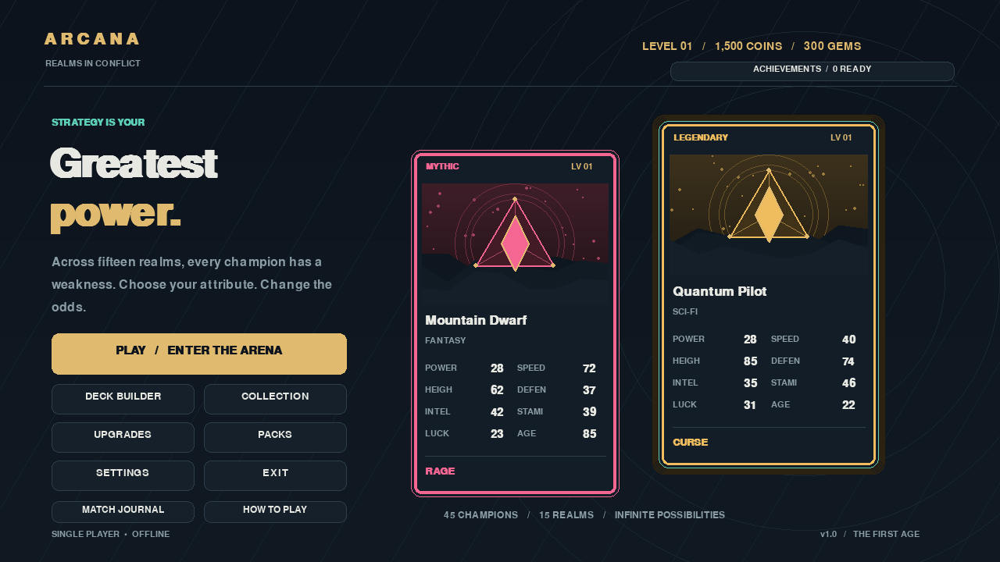

# ARCANA — Realms in Conflict

**بازی کارتی دسکتاپ، تک‌نفره و کاملاً آفلاین با Python و Pygame.**

۴۵ قهرمان از ۱۵ دسته، Deckهای ۳۰ کارتی، انتخاب Greater/Less، ۱۵ Ability، سه Mode، چهار سطح AI، ارتقای کارت، پک، پیشرفت و ذخیرهٔ محلی. رابط بازی فعلاً انگلیسی است؛ این راهنما فارسی است.



> **وضعیت انتشار GitHub:** کد این شاخه منتشر شده است، اما اتصال Arena مجوز ایجاد
> Workflow ندارد. فایل CI در بستهٔ سورس کامل موجود است؛ برای ثبت آن روی همین شاخه
> از حساب مالک، [راهنمای GitHub](docs/GITHUB_SETUP.md) را دنبال کنید. هنوز CI یا EXE
> تأییدشده‌ای از این انتشار گزارش نشده است.

## ۱. نصب و اجرای سریع در Windows

1. Python **3.12 یا جدیدتر** را از [python.org/downloads](https://www.python.org/downloads/) نصب کنید. در نصب‌کننده گزینهٔ **Add Python to PATH** را فعال کنید.
2. پوشهٔ پروژه را باز کنید و در همان پوشه Command Prompt اجرا کنید.
3. دستورهای زیر را به‌ترتیب اجرا کنید:

```bat
python --version
python -m venv venv
venv\Scripts\activate
pip install -r requirements.txt
python main.py
```

بازی مستقیماً وارد Main Menu می‌شود. برای اولین مسابقه: **PLAY → Quick Match → START MATCH**. Deck اولیه معتبر و شامل ۳۰ کارت بازشده است. موجودی اولیه: **۱۵۰۰ Coins و ۳۰۰ Gems**.

اگر `python` پیدا نشد، نصب Python/PATH را اصلاح کنید یا از `py -3.12` استفاده کنید. در PowerShell بدون تغییر Execution Policy هم می‌توان مستقیم اجرا کرد:

```powershell
.\venv\Scripts\python.exe -m pip install -r requirements.txt
.\venv\Scripts\python.exe main.py
```

### اجرای دوبارکلیکی

پس از یک‌بار نصب، روی **`run_game.bat`** دوبارکلیک کنید. این فایل به پوشهٔ خودش می‌رود، وجود `venv` را بررسی می‌کند، آن را فعال و بازی را اجرا می‌کند. اگر محیط مجازی ساخته نشده باشد، دستور نصب را نمایش می‌دهد.

### Linux / macOS

```bash
python3.12 -m venv venv
source venv/bin/activate
python -m pip install -r requirements.txt
python main.py
```

فقط نصب اولیهٔ Python، Pygame و ابزار build نیازمند دریافت فایل است. **خود بازی هیچ اتصال شبکه‌ای ندارد**. برنامه، دسکتاپ native است و وب‌سایت یا برنامهٔ مرورگری نیست.

## ۲. کنترل‌ها و مسیر صفحات

| صفحه | امکانات |
|---|---|
| Main Menu | Play، Deck Builder، Collection، Upgrades، Packs، Settings، Exit و نشان Achievements |
| Play | انتخاب Quick / Classic / Practice، تعویض Deck، اعتبارسنجی، شروع، Resume و Discard |
| Match | کارت بازیکن، کارت مخفی AI، ۸ Attribute، Greater/Less، Ability on/off، Timer، Combo، Score، Battle Log |
| Deck workshop | New، Rename، Delete، تعویض/انتخاب Deck، افزودن/حذف کارت، Search، Category، Rarity، Sort، صفحه‌بندی |
| Collection | کارت‌های بازشده، کارت‌های قفل‌شده با جزئیات مخفی، Level، XP، آمار و توضیح Ability |
| Upgrade forge | دکمهٔ +1 برای هر Attribute؛ هزینهٔ پیش‌فرض ۱۰۰ Coins؛ سقف مقدار ۱۰۰ |
| The vault | شش پک، نمایش قیمت و احتمال‌ها، انیمیشن باز شدن، نمایش کارت جدید/تکراری |
| Settings & records | تنظیمات تصویر/صدا/AI/زمان و آمار ذخیره‌شده |
| Results | نتیجهٔ نهایی، کارت‌های کسب‌شده، XP و Coins راندها، Play Again و Match Journal |
| Match Journal | ۵۰ مسابقهٔ آخر، فیلتر نتیجه، صفحه‌بندی و جزئیات همهٔ راندهای آشکارشده |
| How to Play | مثال تعاملی Greater/Less، مرجع Ability و توضیح Deck/اقتصاد/AI |
| Achievements | ۱۵ دستاورد آفلاین، نوار پیشرفت، فیلتر، صفحه‌بندی و دریافت یک‌بارهٔ جایزه |

- کلیک روی فیلترهای Category/Rarity/Sort به گزینهٔ بعدی می‌رود.
- در Collection و Deck Builder روی Search کلیک و تایپ کنید؛ Enter جست‌وجو را تمام می‌کند. اسکرول موس صفحه را عوض می‌کند.
- Deck دقیقاً **۳۰ کارت یکتا و بازشده** لازم دارد. نسخهٔ اول استفاده از چند کپی یک کارت در Deck را مجاز نمی‌داند.
- در مسابقه کلیدهای **1 تا 8** Attribute، کلید **G** Greater، **L** Less و **Enter** راند بعدی هستند.
- **Escape** بازگشت/تأیید خروج؛ دیالوگ‌ها با Enter تأیید و Escape لغو می‌شوند.
- پیش از Reveal می‌توان Ability کارت خود را روشن/خاموش کرد. Timer خاموش یا ۱۰/۱۵/۳۰/۶۰ ثانیه است. در پایان زمان، سیستم فقط با کارت خود بازیکن انتخاب می‌کند.
- بازگشت از مسابقه به منو تأیید می‌خواهد و Match را Suspend می‌کند. از **PLAY → RESUME** می‌توان پس از بستن برنامه هم ادامه داد. پاداش راندهای تمام‌شده حفظ می‌شود ولی مسابقهٔ ناقص تا پایان در آمار Match ثبت نمی‌شود. **DISCARD** مسابقهٔ معلق را با تأیید حذف می‌کند؛ پاداش‌های قبلی پس گرفته نمی‌شوند.

## ۳. قوانین دقیق نسخهٔ اول

### Deck و Mode

برای هر طرف Deck مستقل ۳۰تایی ساخته و Shuffle می‌شود. Deck حریف نمونهٔ تصادفی بدون تکرار از دیتابیس عمومی است؛ همپوشانی بین دو Deck مجاز است. کارت بعدی از ترتیب تصادفی ازپیش‌ساخته کشیده می‌شود، نه با دیدن کارت حریف.

| Mode | راند | انتخاب Attribute/جهت | پاداش |
|---|---:|---|---|
| Quick Match | ۱۰ | همیشه بازیکن | دارد |
| Classic Match | ۳۰ | نوبتی؛ بازیکن آغاز می‌کند | دارد |
| Practice | ۱۰ | بازیکن | بدون تغییر اقتصاد، XP یا آمار |

Quick و Practice ده کارت اول Deckهای Shuffleشده را مصرف می‌کنند. کارت‌های کسب‌شده مجدداً وارد صف Deck نمی‌شوند؛ بنابراین مسابقه قطعاً پایان دارد.

### مقایسه و امتیاز

1. کارت بازیکن آشکار و کارت AI مخفی است.
2. صاحب نوبت Attribute و Greater/Less را انتخاب می‌کند.
3. کارت AI با انیمیشن Flip آشکار می‌شود.
4. اثرهای ماندگار قبلی اعمال و Abilityهای دو طرف حل می‌شوند.
5. مقادیر به **comparison strength** تبدیل می‌شوند: برای Greater همان مقدار Attribute؛ برای Less مقدار `101 - attribute`.
6. Abilityها روی strength اثر می‌گذارند؛ strength بزرگ‌تر برنده است. این تعریف باعث می‌شود Boost در Less هم مفید باشد. strength نهایی ممکن است بیرون از ۱..۱۰۰ باشد؛ Attribute اصلی همچنان محدود است.
7. برنده **هر دو کارت راند** را به مجموعهٔ کارت‌های کسب‌شدهٔ آن Match اضافه می‌کند؛ هر کارت یک امتیاز دارد. این کسب کارت، **امتیاز مسابقه است، نه انتقال مالکیت دائمی مجموعه**. کارت‌های دائمی از پک‌ها باز می‌شوند.
8. XP، Coins، Combo و Save به‌روزرسانی می‌شوند. نتیجه تا انتخاب Next Round روی صفحه باقی می‌ماند.

در `config.json` مقدار `tie_rule`:

- `none`: تساوی بدون برنده؛ کارت‌های آن راند کنار گذاشته می‌شوند.
- `random`: انتخاب تصادفی برنده از دو طرف.
- `carry` (پیش‌فرض): کارت‌های مساوی در جایزه می‌مانند و برندهٔ راند بعد همه را می‌گیرد. جایزهٔ حل‌نشده در پایان مسابقه به هیچ‌کس داده نمی‌شود.

تساوی Combo هر دو طرف را می‌شکند. بالاترین تعداد کارت کسب‌شده نتیجهٔ Match را تعیین می‌کند؛ مساویِ Match نه برد محسوب می‌شود و نه باخت.

### Abilityها

تعاریف و مقدارها در `data/abilities.json` هستند. اثرها ابتدا با وضعیت مشترک آغاز راند محاسبه و سپس جمع می‌شوند؛ ترتیب Player/AI مزیت ناعادلانه ندارد. Silence مقدم است، و Copy/Mirror بازگشت بازگشتی ندارند.

| Ability | رفتار فعلی |
|---|---|
| Shield | کاهش strength حریف به‌اندازهٔ ۸ |
| Heal | افزایش HP تا سقف ۱۰۰ به‌اندازهٔ ۱۲؛ در HP کامل، +۲ strength |
| Freeze | −۶ strength حریف در راند بعد |
| Poison | −۴ strength حریف در دو راند بعد |
| Curse | −۱۰ strength حریف |
| Critical Strike | احتمال ۳۵٪ برای +۲۰ strength |
| Mirror / Copy | اجرای Ability حریف به نفع خود در همین راند؛ دو Reflector هم‌زمان بی‌اثرند |
| Double Attack | مجموع دو ضربهٔ +۶، یعنی +۱۲ strength در همین مقایسه |
| Counter | +۱۵ strength اگر در آغاز حل Ability عقب باشد |
| Revive | +۱۸ strength اگر راند قبل باخته باشد |
| Boost | +۹ strength |
| Silence | Ability حریف را در همان راند غیرفعال می‌کند |
| Dodge | ۴۰٪ احتمال −۱۴ strength حریف |
| Rage | +۱۴ strength اگر Power کارت حداقل ۸۰ باشد |

HP هر طرف از ۱۰۰ شروع می‌شود و با باخت ۱۰ کم می‌شود؛ در این Modeهای مقایسه‌ای **HP شرط حذف یا پایان نیست**. زیرساخت Heal/HP برای Modeهای آینده نیز قابل استفاده است. Freeze انتخاب کاربر را مسدود نمی‌کند، بلکه قدرت مقایسهٔ راند بعد را محدود می‌کند. Abilityهای Copy و Mirror در نسخهٔ اول معنای یکسان دارند. جزئیات واقعی اثرها در Battle Log و Collection قابل مشاهده است.

### AI بدون تقلب

`AIPlayer.choose(own_values, public, ability)` **هیچ پارامتر کارت حریف ندارد**. ورودی فقط مقادیر کارت خودش، Ability خودش، Score/Combo/تعداد کارت باقی‌مانده و توزیع عمومی دیتابیس است. محتوای Deck بازیکن وارد تصمیم‌گیری AI نمی‌شود.

- Easy: Attribute/جهت تصادفی، احتمال فعال‌کردن Ability برابر ۳۵٪.
- Normal: بیشترین مقدار برای Greater یا کمترین مقدار برای Less؛ Ability با احتمال ۶۰٪.
- Hard: بهترین انتخاب بر اساس کارت خود، Ability با احتمال ۹۰٪.
- Expert: احتمال برد بر اساس توزیع عمومی Attributeها، برآورد اثر Ability، وضعیت ماندگار، Score، Combo و تعداد راند باقی‌مانده؛ Ability فعال است. این یک heuristic قابل توسعه است، نه جست‌وجوی کامل یا AI یادگیرنده.

## ۴. اقتصاد و پیشرفت

- برد راند: ۵۰ XP و ۲۵ Coins؛ باخت/تساوی: ۲۰ XP.
- هر سومین برد پیاپی: +۵۰ XP؛ هر پنجمین برد پیاپی: +۱۰۰ Coins.
- XP کارت: آستانه‌های ۱۰۰، ۲۵۰، ۵۰۰ برای سه Level اول؛ از آن پس هر آستانه ۲۵۰ بیشتر می‌شود. XP با Level Up مصرف می‌شود.
- هر Level کارت به‌طور پیش‌فرض +۱ به Attributeها می‌دهد؛ سقف ۱۰۰. کارت‌های Level 5+ Glow اضافه دارند.
- آستانهٔ XP بازیکن: `level * 250`. هر Level Up: ۵۰۰ Coins و ۲۰ Gems.
- پایان Match: ۱۵ Gems برای برد، ۵ Gems برای باخت/تساوی.
- جزئیات پاداش و هزینه‌ها در `config.json` قابل تنظیم است.
- Rarityهای Common/Uncommon/Rare/Epic/Legendary/Mythic با نرخ پایهٔ 50/25/14/7/3/1 درصد تعریف شده‌اند. پک‌ها می‌توانند توزیع اختصاصی داشته باشند؛ نرخ‌های واقعی روی صفحهٔ پک نمایش داده می‌شود.
- Starter و Bronze سه کارت، Silver و Gold پنج کارت، Diamond هفت کارت و Mythic ده کارت دارند.
- Duplicate Protection **درون Rarity انتخاب‌شده** است: تا وقتی کارت ناشناخته از همان Rarity وجود دارد، تکراری نمی‌آید. پس از تکمیل آن Rarity، کارت تکراری +۵۰ Coins می‌دهد و تعداد کپی‌های مالکیت نیز ثبت می‌شود. تضمین عدم تکرار بین همهٔ Rarityها وجود ندارد.

## ۵. ذخیره و خطایابی

### مسیرها

- اجرای سورس: `saves/player_save.json` در ریشهٔ پروژه.
- نسخهٔ Windows EXE: `%LOCALAPPDATA%\ArcanaCardGame\saves\player_save.json`؛ مستقل از پوشهٔ نصب و پوشهٔ موقت PyInstaller.
- Log: `game.log` در ریشهٔ پروژه، یا `%LOCALAPPDATA%\ArcanaCardGame\game.log` در نسخهٔ EXE.

Save شامل Level/XP/Coins/Gems بازیکن، Owned/Unlocked Cards، Deckها و Deck انتخاب‌شده، Level/XP/Upgrades کارت‌ها، Settings، Statistics، `match_history`، checkpoint داخلی `active_match` و فهرست `claimed_achievements` است. ذخیره در شروع مسابقه، بعد از حل راند، رفتن به راند بعد، عملیات اقتصادی/ویرایش، Suspend و هنگام خروج انجام می‌شود. نوشتن از طریق فایل موقت و جایگزینی atomic است.

Save خراب به نام `player_save.corrupt-<timestamp>` نگهداری و Save پیش‌فرض ساخته می‌شود. فایل‌های Save شخصی وارد Git نمی‌شوند. برای reset، پس از بستن بازی از Save بکاپ بگیرید و آن را حذف کنید.

تصویر، صدا و فونت اختیاری هستند. در نبود تصویر، هنر هندسی اختصاصی و قطعی هر کارت رندر می‌شود؛ فونت داخلی Pygame جایگزین فونت خارجی است؛ نبود دستگاه یا فایل صدا سبب توقف بازی نمی‌شود. اگر `cards.json` حذف یا تمام کارت‌هایش نامعتبر شود، منو و تنظیمات باز می‌مانند ولی شروع Match ممکن نیست؛ دیتابیس را بازگردانید. کارت نامعتبر با Warning از دیتابیس کنار گذاشته می‌شود.

## ۶. ساختار کامل فایل‌های پروژه

```text
fantasy-card-battle/
├── main.py                       # Entry point؛ CLI و smoke test
├── requirements.txt              # فقط Pygame برای اجرای بازی
├── requirements-build.txt        # ابزارهای بسته‌بندی، مستقل از Runtime
├── config.json                   # قوانین، هزینه‌ها، پاداش‌ها، Modeها
├── run_game.bat                  # اجرای Windows با venv
├── build_game.bat                # Build و تأیید باینری روی Windows
├── build_game.sh                 # همان مسیر برای Linux
├── CardGame.spec                 # بسته‌بندی one-file با PyInstaller
├── README.md
├── .gitignore
├── .github/workflows/test-and-build.yml
├── data/
│   ├── cards.json                # ۴۵ کارت با همهٔ فیلدهای درخواستی
│   ├── abilities.json            # ۱۵ Ability و پارامترهای اثر
│   ├── rarities.json             # رنگ، قاب، Glow و وزن‌ها
│   ├── packs.json                # قیمت، تعداد، ارز و احتمال‌ها
│   ├── achievements.json         # ۱۵ دستاورد: شناسه، شرط، گروه و پاداش
│   ├── settings.json             # تنظیمات پیش‌فرض
│   └── locales/en.json           # کاتالوگ ترجمه؛ English fallback
├── assets/
│   ├── README.md                 # نام و فرمت فایل‌های اختیاری
│   ├── cards/.gitkeep
│   ├── ui/.gitkeep
│   ├── backgrounds/.gitkeep
│   ├── icons/.gitkeep
│   ├── effects/.gitkeep
│   ├── fonts/.gitkeep
│   ├── sounds/                  # ۹ افکت WAV به‌همراه .gitkeep
│   └── music/                   # menu.wav و battle.wav به‌همراه .gitkeep
├── src/
│   ├── __init__.py
│   ├── game.py                   # Window، Game Loop، ورودی و Navigation
│   ├── game_manager.py           # اتصال سرویس‌ها و شروع Match
│   ├── cards/
│   │   ├── __init__.py
│   │   ├── card.py               # مدل immutable و مقادیر مؤثر
│   │   └── card_database.py       # بارگذاری/اعتبارسنجی JSON
│   ├── battle/
│   │   ├── __init__.py
│   │   ├── battle_manager.py     # RoundResult، Match، امتیاز و پاداش
│   │   ├── match_journal.py      # تاریخچهٔ محدود، ثبت نتیجه و validation
│   │   └── checkpoint.py         # encode/decode امن JSON، RNG و validation Resume
│   ├── ai/
│   │   ├── __init__.py
│   │   └── ai_player.py          # چهار استراتژی؛ فقط اطلاعات مجاز
│   ├── abilities/
│   │   ├── __init__.py
│   │   └── ability_manager.py    # رجیستری handler و حل اثرها
│   ├── deck/
│   │   ├── __init__.py
│   │   └── deck_manager.py       # CRUD، انتخاب و validation
│   ├── progression/
│   │   ├── __init__.py
│   │   ├── xp_system.py         # Level، XP، Reward، Upgrade
│   │   └── achievement_system.py # محاسبهٔ پیشرفت و اعتبارسنجی دریافت جایزه
│   ├── economy/
│   │   ├── __init__.py
│   │   └── pack_system.py       # weighted drops و duplicate protection
│   ├── ui/
│   │   ├── __init__.py
│   │   ├── menu.py              # Base Screen، Menu و انتخاب Mode
│   │   ├── collection.py        # Collection، Deck Builder، Upgrade forge
│   │   ├── match_screen.py      # Match، Reveal، Timer، Result
│   │   ├── packs.py             # Vault و بازشدن پک
│   │   ├── settings.py          # Settings و آمار
│   │   ├── journal.py           # مرور و فیلتر مسابقات تمام‌شده
│   │   ├── help_screen.py       # راهنمای داخل بازی و مثال تعاملی
│   │   ├── achievements.py      # صفحهٔ دستاوردها و دریافت جایزه
│   │   ├── card_view.py         # هنر fallback، قاب، پشت کارت و Glow
│   │   └── widgets.py           # Button، Panel، Text، Progress bar
│   └── systems/
│       ├── __init__.py
│       ├── data_validation.py   # اعتبارسنجی Config، Rarity، Ability، Pack و Settings
│       ├── resources.py         # مسیرهای سورس/EXE، JSON، Logger
│       ├── save_system.py       # atomic save، validation و recovery
│       ├── asset_manager.py     # کش تصویر/فونت و fallback
│       ├── sound_manager.py     # رویدادهای صوتی و موسیقی
│       ├── animation_manager.py # easing، زمان انیمیشن و pulse
│       ├── localization.py      # lookup و English fallback
│       └── self_test.py         # تست Runtime قابل اجرا از خود باینری
├── saves/
│   ├── .gitkeep
│   └── player_save.json         # خودکار؛ ignored
├── tests/
│   ├── test_core.py
│   ├── test_ui.py
│   ├── test_validation.py
│   ├── test_audio.py
│   ├── test_journal.py
│   ├── test_checkpoint.py
│   ├── test_achievements.py
│   └── test_distribution.py
├── tools/
│   ├── validate_data.py          # بررسی داده‌ها با exit code و خروجی JSON
│   ├── generate_audio.py         # تولید قابل تکرار ۱۱ فایل صوتی
│   └── build_release.py          # preflight، تست، Build، بررسی باینری، ZIP/SHA-256
└── docs/
    ├── main-menu.png
    ├── match.png
    ├── collection.png
    ├── field-guide.png
    ├── match-journal.png
    ├── resume-match.png
    ├── achievements.png
    ├── TEST_REPORT.md
    ├── PACKAGING.md
    ├── GITHUB_SETUP.md
    ├── DISTRIBUTION_README.txt
    ├── runtime-verification.json # گزارش واقعی سورس؛ frozen=false
    └── build-environment.json    # گزارش واقعی پیش‌نیازها؛ در این محیط failed
```

برای کاهش فایل‌های بی‌محتوا، کلاس‌های نزدیک به هم در یک ماژول قرار گرفته‌اند: `RoundResult` کنار Battle، سه نمای Library در `collection.py`، و XP/Level/Upgrade در سرویس Progression. منطق اصلی به Pygame وابسته نیست؛ UI، داده، AI و Persistence از هم جدا هستند.

## ۷. Build به EXE

**EXE ویندوز را روی Windows بسازید**؛ PyInstaller به‌طور عادی cross-compile نمی‌کند. راهنمای کامل در [`docs/PACKAGING.md`](docs/PACKAGING.md) است.

مسیر پیشنهادی با Python 3.12+:

```bat
venv\Scripts\activate
python -m pip install -r requirements-build.txt
python tools\build_release.py --check
python tools\build_release.py
```

یا پس از نصب وابستگی‌ها روی **`build_game.bat`** دوبارکلیک کنید. روی Linux، از `./build_game.sh` برای خروجی Linux استفاده کنید.

ابزار ابتدا نسخهٔ Python، shared library و وابستگی‌ها را بررسی می‌کند؛ سپس اعتبارسنجی داده‌ها، تست‌ها، Self-test سورس، Build با PyInstaller و **Self-test از خود خروجی مستقل در پوشه‌ای خارج از پروژه** را انجام می‌دهد. تنها بعد از موفقیت همهٔ مراحل، `dist\CardGame.exe`، ZIP مخصوص OS/معماری، `manifest.json`، گزارش runtime و checksum فایل ZIP تولید می‌شوند.

گزارش کلی: `build/release-report.json`. Logها و جزئیات: `build/release-checks/`. `--check` فقط پیش‌نیازها را بررسی می‌کند و ساخت باینری محسوب نمی‌شود.

روش دستی اولیه نیز موجود است، ولی به‌تنهایی خروجی تأییدشدهٔ ابزار بالا نیست:

```bat
pip install pyinstaller
python -m PyInstaller --noconfirm CardGame.spec
```

روش مستقیم بدون spec روی Windows:

```bat
python -m PyInstaller --noconfirm --onefile --windowed --name CardGame --add-data "data;data" --add-data "assets;assets" --add-data "config.json;." main.py
```

`data/`، `assets/` و `config.json` داخل خروجی قرار می‌گیرند؛ کاربر مقصد Python لازم ندارد. `build/` و `dist/` generated و ignored هستند. نسخهٔ one-file ممکن است برای استخراج اولیه چند ثانیه زمان بخواهد. فایل unsigned ممکن است هشدار SmartScreen بدهد؛ برای توزیع عمومی مجوزهای اجزای ثالث و code signing معتبر را بررسی کنید.

گردش‌کار `.github/workflows/test-and-build.yml` برای تست روی Linux/Windows با Python 3.12/3.13 و Build/تأیید native در jobهای 3.12 تنظیم شده است. **این گردش‌کار در این جلسه اجرا نشده؛ باینری مستقل یا ZIP تأییدشده‌ای نیز در این sandbox تولید نشده است.**

## ۸. تست‌ها و وضعیت واقعی تأیید

```bash
python tools/validate_data.py
python -m unittest discover -s tests -v
python main.py --headless --smoke 30
python main.py --headless --smoke 30 --screenshot menu.png
python main.py --self-test --report build/runtime.json
```

تست‌های UI از درایور dummy رسمی SDL استفاده می‌کنند؛ نیاز به مانیتور یا اینترنت ندارند. با Save موقت کار می‌کنند و Save شخصی شما را تغییر نمی‌دهند. دستور smoke معمولی Save پیش‌فرض بازی را ایجاد می‌کند.

**۱۶۸ تست** برای دیتابیس، Draw، Shuffle، Deck CRUD/validation، Greater/Less، هر سه Tie، AI، تمام Abilityها، Combo، XP، Level، Upgrade، هر شش پک، Duplicate Protection، Save/Load/recovery، Settings، Missing Assets و مسیر کامل کلیک منو تا Result نوشته و در محیط تحویل با موفقیت اجرا شدند. رندر 1280×720 و 1920×1080 نیز تست شده است.

گزارش جزئی در [`docs/TEST_REPORT.md`](docs/TEST_REPORT.md) است. محیط محلی Linux، Python **3.11.2** و Pygame **2.6.1** داشت. دریافت Python 3.12 با خطای TLS شبکه متوقف شد؛ بنابراین تست محلی روی 3.12 یا Windows را ادعا نمی‌کنیم. Build محلی PyInstaller هم به‌علت نبود کتابخانهٔ مشترک Python در sandbox متوقف شد. فایل spec و CI آماده‌اند، ولی **EXE ویندوز در این تحویل ساخته یا تست نشده است**. بررسی دستگاه واقعی برای صدا، Fullscreen، DPI و EXE همچنان توصیه می‌شود.

## ۹. توسعهٔ داده و سیستم‌ها

### اضافه‌کردن کارت

یک object با ID و نام یکتا به آرایهٔ `data/cards.json` اضافه کنید:

```json
{
  "id": 46,
  "name": "Crystal Sentinel",
  "description": "A guardian of the crystal gate.",
  "category": "Fantasy",
  "rarity": "Epic",
  "level": 1,
  "xp": 0,
  "power": 79,
  "speed": 42,
  "height": 90,
  "defense": 95,
  "intelligence": 66,
  "stamina": 88,
  "luck": 37,
  "age": 64,
  "ability": "Shield",
  "image": "assets/cards/crystal_sentinel.png",
  "sound": "",
  "tags": ["crystal", "guardian"]
}
```

مقادیر هر هشت Attribute باید ۱ تا ۱۰۰ باشند. تصویر اختیاری است. کارت جدید در Save موجود به‌طور خودکار Owned نمی‌شود؛ با پک باز می‌شود. کارت‌های جدید بدون تغییر Core در Collection، Filter و Pool پک‌ها حاضر می‌شوند. پس از ویرایش داده بازی را دوباره اجرا کنید؛ نسخهٔ EXE را باید دوباره Build کرد.

### اضافه‌کردن Category

کافی است `category` کارت جدید یا موجود را به رشتهٔ دلخواه تغییر دهید. فهرست دسته‌ها از دیتابیس استخراج می‌شود؛ ثبت ثابت در Core وجود ندارد.

### اضافه‌کردن Rarity

در `data/rarities.json` یک ورودی با `color` (آرایهٔ RGB)، `weight`، `border` و `glow` اضافه کنید. Rarity کارت را به آن نام تنظیم و در `data/packs.json` وزن آن را برای پک‌های دلخواه اضافه کنید. وزن‌ها نسبی‌اند و هنگام انتخاب نرمال می‌شوند. اگر پک `weights` نداشته باشد از وزن‌های عمومی Rarity استفاده می‌کند.

### اضافه‌کردن Ability

برای ترکیب جدید از اثرهای موجود فقط JSON لازم است، مثلاً:

```json
"Focus": {
  "effect": "boost",
  "amount": 11,
  "description": "Gain 11 comparison strength.",
  "ai_strength_estimate": 11
}
```

نام `Focus` را در فیلد `ability` کارت بگذارید. برای **رفتار واقعاً جدید**، handler با امضای زیر بنویسید و از `AbilityManager.register(effect, handler)` یا رجیستری constructor استفاده کنید:

```python
def effect_handler(side, definition, strengths, values, states, delta):
    delta[side] += definition.get("amount", 0)
```

`side` برابر ۰ یا ۱ است؛ `delta` جمع تغییر strength هر طرف، `states` شامل HP/Status/LostLast، و `values` مقادیر کارت‌های همین راند **پس از Reveal** است. effect ناشناخته بازی را متوقف نمی‌کند و بی‌اثر است. برای اثر تازه تست قطعی با RNG تزریقی اضافه کنید. Core Card برای افزودن Ability تغییر نمی‌کند.

### صدا، تصویر و زبان

نام فایل‌ها در [`assets/README.md`](assets/README.md) آمده است. **۹ افکت صوتی و دو موسیقی ۱۶ثانیه‌ای تولیدشده با کد همراه پروژه هستند**؛ فایل‌ها WAV، کاملاً آفلاین و بدون نمونهٔ صوتی دانلودشده‌اند. ولوم Master/Music/Sound فوراً اعمال می‌شود. فایل‌های OGG سفارشی اولویت دارند و در صورت خرابی، WAV جایگزین می‌شود. با `python tools/generate_audio.py` می‌توان تمام این فایل‌ها را بدون وابستگی اضافه بازتولید کرد. کیفیت شنیداری روی دستگاه واقعی هنوز نیاز به بررسی انسانی دارد. تصویرها فعلاً هنر procedural هستند، نه تصویرسازی واقع‌گرایانهٔ هر شخصیت.

`Localization` از کاتالوگ `data/locales/en.json` و کلیدهای متن مبنا استفاده می‌کند. برای زبان جدید کاتالوگ و نگاشت زبان در Settings را اضافه کنید. فارسی علاوه بر ترجمه به فونت مناسب، RTL و shaping نیاز دارد؛ **رابط فارسی در این نسخه پیاده‌سازی نشده است**.

## ۱۰. عیب‌یابی و مرز نسخهٔ اول

- `No module named pygame`: محیط مجازی را فعال و requirements را با همان Python نصب کنید.
- پنجره باز نمی‌شود: اجرا روی دسکتاپ دارای Display لازم است؛ روی سرور فقط `--headless --smoke 30` را استفاده کنید.
- Save نوشته نمی‌شود: مجوز نوشتن مسیر را بررسی کنید؛ پیام خطا و Log ثبت می‌شود.
- Deck نامعتبر: دقیقاً ۳۰ کارت یکتای بازشده انتخاب کنید.
- تصویر/صدا دیده یا شنیده نمی‌شود: مسیر نسبی، نام و فرمت را بررسی کنید؛ fallback طبیعی است.
- JSON ویرایش‌شده خطا دارد: JSON معتبر، ID یکتا و مقدارهای عددی ۱..۱۰۰ لازم است. برای Config/Ability/Packهای سفارشی، نام فیلدها و مقدارهای معتبر مثال‌ها را رعایت کنید؛ با `python tools/validate_data.py` داده‌ها را بررسی کنید. مقدارهای نامعتبر قوانین با default امن جایگزین، و پک‌های نامعتبر غیرفعال می‌شوند؛ فایل اصلی خودکار بازنویسی نمی‌شود. این نسخه editor گرافیکی داده‌ها ندارد.
- چند اجرای هم‌زمان روی یک Save پشتیبانی نمی‌شود؛ آخرین ذخیره برنده است.
- بالانس ۴۵ کارت، rarityها و پاداش‌ها یک نقطهٔ شروع است؛ playtest انسانی گسترده و بالانس رقابتی انجام نشده است.
- مقیاس UI بر پایهٔ canvas منطقی 1280×720، letterbox و تبدیل مختصات ورودی است؛ تست رندر در Full HD انجام شده اما تست DPI/Fullscreen روی سخت‌افزار واقعی Windows انجام نشده است.

## ۱۱. مرحلهٔ بعدی

مرزهای مستقل Database، AbilityManager، BattleManager، AI، Progression، SaveSystem و Screens برای توسعه آماده‌اند. Modeهای Tournament/Campaign/Boss می‌توانند از BattleManager و HP استفاده کنند؛ Quests از سرویس AchievementSystem موجود و آمار و نتایج راند؛ Cloud Save از جایگزین SaveSystem؛ و AI جدید از همین رابط بدون دسترسی به اطلاعات مخفی.

**Online/PvP، Cloud Save، Leaderboard، Trading، Daily Missions، Crafting/Fusion/Evolution، Controller، Android و نسخهٔ موبایل اکنون پیاده‌سازی نشده‌اند.** افزودن شبکه نیازمند authoritative server، پروتکل/همگام‌سازی و امنیت است؛ موبایل هم ورودی لمس و بسته‌بندی مستقل می‌خواهد. برای ۱۰۰۰+ کارت بهتر است کش تصویر LRU و نمای مجازی مجموعه اضافه شود. پروژهٔ فعلی پایهٔ قابل توسعهٔ تک‌نفرهٔ آفلاین است، نه ادعای آماده‌بودن همهٔ این محصولات آینده.


## ۱۲. ادامهٔ تکمیل نسخهٔ اول: اعتبارسنجی و صدا

- مجموعهٔ آزمون در پایان این مرحله **۷۴ تست موفق** داشت: ۳۲ منطق اصلی، ۱۵ رابط، ۱۹ اعتبارسنجی داده و ۸ صدا.
- همهٔ فایل‌های قوانین قبل از استفاده از طریق `DataCatalog` بررسی می‌شوند. تقسیم بر صفر در Combo، Level Up با آستانهٔ صفر، رنگ قاب نامعتبر و مقدارهای NaN/Infinity به مسیر امن هدایت می‌شوند.
- پک با قیمت منفی، ارز ناشناخته، احتمال نامعتبر یا تعداد بیرون از ۱..۱۰ **غیرفعال** می‌شود؛ به‌جای اصلاح پنهانی خرید، مشکل در Log و بررسی CLI گزارش می‌شود.
- افزودن پک‌های بیشتر از شش مورد اکنون با صفحه‌بندی Vault پشتیبانی می‌شود. دوبارکلیک روی Open دیگر دو خرید پشت سر هم با از دست رفتن نمایش پک اول ایجاد نمی‌کند.
- هر Rarity و Category جدید همچنان داده‌محور است. Deck نسخهٔ فعلی ۳۰تایی است؛ تعداد کارت یک پک ۱..۱۰ است. Mode جدید فقط با اضافه‌کردن JSON فعال نمی‌شود و نیاز به پیاده‌سازی مسیر UI/قوانین دارد؛ نام‌های Mode ناشناخته گزارش و نادیده گرفته می‌شوند.
- Ability با effect جدید، فیلدهای اختصاصی‌اش را حفظ می‌کند ولی handler آن باید ثبت شود؛ ابزار بررسی، handler ناشناخته را گزارش می‌کند.
- گزارش ماشینی و قابل استفاده در CI:

```bash
python tools/validate_data.py --json
```

خروجی موفق `exit code 0` و دادهٔ نامعتبر `exit code 1` دارد. بازی در عوض تا حد امکان با fallback امن باز می‌شود و هشدار کوتاه نشان می‌دهد. نام effect سفارشی را در ابزار بررسی هم مطابق رجیستری runtime خود ثبت کنید.

**وضعیت EXE تغییری نکرده است:** فایل spec، اسکریپت Build و گردش‌کار Windows آماده‌اند؛ در این محیط هنوز EXE ویندوز ساخته یا اجرا نشده است.


## ۱۳. دفترچهٔ مسابقات و راهنمای داخل بازی

در منوی اصلی دو دکمهٔ جدید وجود دارد:

### MATCH JOURNAL

- ثبت خودکار **۵۰ مسابقهٔ تمام‌شدهٔ اخیر** در همان `saves/player_save.json`، زیر کلید `match_history`.
- ثبت Quick و Classic؛ مسابقهٔ نیمه‌تمام و Practice پیش‌فرض ذخیره نمی‌شوند.
- ثبت تاریخ UTC، Mode، Difficulty، امتیاز دو طرف، مجموع XP و Coins راندها.
- برای هر راند: نام دو کارت آشکارشده، انتخاب‌کننده، Attribute و Greater/Less، مقدار اولیه، strength نهایی، برنده، تعداد کارت کسب‌شده و پیام‌های Ability.
- صف Deck و کارت‌های هنوز مخفی در دفترچه ثبت نمی‌شوند. در Quick فقط همان راندهای انجام‌شده دیده می‌شوند، نه بقیهٔ Deck سی‌تایی.
- فیلتر All/Win/Loss/Tie، هشت Match در هر صفحه و پنج راند در هر صفحهٔ جزئیات.
- از صفحهٔ Result نیز می‌توان مستقیم وارد دفترچه شد.
- بازدید دفترچه **read-only** است؛ پاداش، آمار و XP دوباره اعمال نمی‌شود. ثبت یک Match چندباره نمی‌شود.
- Saveهای قدیمی بدون تاریخچه با آرایهٔ خالی باز می‌شوند. اگر فقط یک مدخل تاریخچه خراب باشد، همان مدخل کنار گذاشته می‌شود؛ Coins و پیشرفت سالم reset نمی‌شوند.
- XP و Coins نمایش‌داده‌شده مجموع پاداش **راندها** هستند؛ جایزهٔ Level Up جدا از این جمع است.

### HOW TO PLAY

سه صفحهٔ راهنما:

1. اولین راند و مثال قابل کلیک `85 : 72` برای تجربهٔ تفاوت Greater/Less، بدون خرج یا پاداش.
2. مرجع Abilityهای بارگذاری‌شده از JSON، ترتیب اثرها، نقش HP و محدودیت اطلاعات AI.
3. ساخت Deck، ارتقا، پاداش‌ها و Modeها؛ هزینه و نرخ‌های عددی اصلی از Config جاری خوانده می‌شوند.

رابط راهنما مانند بقیهٔ بازی فعلاً انگلیسی است. این بخش آموزش و مرور است، نه Replay تعاملی. Resume مستقل از دفترچه است و در مرحلهٔ بعدی زیر اضافه شده است.

**وضعیت آزمون در پایان این مرحله: ۹۵ تست موفق**، شامل ۲۱ تست جدید منطق/رابط دفترچه و راهنما. تصاویر واقعی صفحات در `docs/field-guide.png` و `docs/match-journal.png` قرار دارند. تست‌ها همچنان روی محیط محلی Python 3.11.2 / Pygame 2.6.1 اجرا شدند؛ تأیید Windows EXE یا Python 3.12 محلی به این مرحله اضافه نشده است.


## ۱۴. ادامهٔ مسابقهٔ نیمه‌تمام — RESUME

### روش استفاده

1. یک Match شروع کنید. checkpoint اولیه در همان فایل Save نوشته می‌شود.
2. برای توقف، **LEAVE / Escape** و تأیید Suspend را انتخاب کنید؛ بستن پنجره نیز Save می‌کند.
3. پس از بازکردن دوبارهٔ بازی، **PLAY → RESUME / ROUND ...** را بزنید.
4. اگر به‌جای ادامه مسابقهٔ تازه می‌خواهید، **START MATCH** تأیید جایگزینی می‌گیرد. **DISCARD** فقط مسابقهٔ معلق را حذف می‌کند. پاداش‌های راندهای تمام‌شده حفظ می‌شوند.

یک اسلات برای مسابقهٔ معلق وجود دارد. Quick، Classic و Practice قابل ادامه‌اند؛ Practice حتی پس از Resume نیز پاداش، آمار Match و Journal ندارد.

### چه چیزهایی حفظ می‌شوند؟

- ترتیب کامل دو Deck، شمارهٔ راند، Score، Combo، کارت‌های کسب‌شده و جایزهٔ تساوی معلق.
- HP، Freeze/Poison و مدت اثرهای ماندگار.
- نتیجه و پیام‌های راندهای آشکارشده؛ اگر راند حل شده باشد، همان نتیجه با دکمهٔ Next Round برمی‌گردد.
- حالت RNG و Difficulty اصلی؛ بازکردن دوبارهٔ بازی کارت‌ها را Shuffle و احتمال‌ها را دوباره قرعه‌کشی نمی‌کند.
- Attributes مؤثر بازیکن در شروع Match. ارتقا یا ویرایش Deck هنگام توقف، نبرد ذخیره‌شده را عوض نمی‌کند؛ تغییرها در مسابقهٔ تازه اثر دارند. اعداد روی کارت نبرد هم همین مقدارهای ثابت هستند.

### مرز دقیق ذخیره و زمان‌سنج

Resume از **آخرین checkpoint موفق** است، نه ذخیرهٔ تک‌تک فریم‌های انیمیشن:

- راند حل‌شده دوباره مقایسه نمی‌شود و XP/Coins آن دوباره پرداخت نمی‌شود.
- برای راند حل‌نشده، انتخاب Attribute/جهتِ تأییدنشده و انیمیشن نیمه‌تمام بازیابی نمی‌شوند؛ انتخاب و Timer از ابتدا شروع می‌شوند. Ability بازیکن نیز به حالت روشن پیش‌فرض برمی‌گردد.
- تنظیمات فعلی Timer/صدا/تصویر اعمال می‌شود؛ Difficulty و Attributes نبرد از checkpoint می‌آید.
- در خطای نوشتن Save، پیام خطا نشان داده می‌شود و آخرین فایل موفق باقی می‌ماند؛ پیشرفت پس از آن checkpoint در صورت بسته‌شدن بازی تضمین نمی‌شود.

### سازگاری و امنیت فایل

`active_match` و موجودی/XP در **همان جایگزینی atomic فایل JSON** نوشته می‌شوند، نه دو فایل جدا. Resume هیچ مسیر replay برای اعمال مجدد پاداش ندارد. پایان Match، checkpoint را پاک و نتیجه را یک‌بار در آمار/Journal ثبت می‌کند.

checkpoint نسخه‌دار است و fingerprint دیتابیس کارت‌ها، Config و Abilityها دارد. اگر این داده‌ها پس از توقف تغییر کرده باشند، Resume غیرفعال و checkpoint نامعتبر کنار گذاشته می‌شود؛ **Coins، Level و پیشرفت سالم باقی می‌ماند**. Saveهای قدیمی بدون `active_match` همچنان بارگذاری می‌شوند.

checkpoint برای بازیابی ترتیب آینده، کارت‌های هنوز مخفی را در بخش داخلی Save نگه می‌دارد؛ **این اطلاعات به ورودی AI یا صفحهٔ Journal داده نمی‌شود**. فایل محلی JSON رمزگذاری‌شده یا ضدتقلب نیست و صاحب فایل می‌تواند آن را بررسی کند. deserialization از `pickle` یا اجرای کد استفاده نمی‌کند.

**وضعیت آزمون در پایان مرحلهٔ Resume: ۱۲۰ تست موفق**؛ ۲۵ تست جدید برای Resume، ادامهٔ یکسان در همهٔ Modeها/Difficultyها، جلوگیری از پرداخت دوباره، خطای Save، snapshot خراب، سازگاری Save قدیمی و مسیرهای واقعی UI اضافه شده است. تصویر واقعی صفحهٔ Resume در `docs/resume-match.png` است. وضعیت تأیید Windows EXE و Python 3.12 محلی همچنان تغییری نکرده است.


## ۱۵. دستاوردهای آفلاین — ACHIEVEMENTS

### دسترسی و استفاده

در **بالای سمت راست Main Menu** روی `ACHIEVEMENTS / N READY` کلیک کنید. در صفحهٔ Settings هم دکمهٔ Achievements وجود دارد. تعداد READY نشان می‌دهد چند جایزه هم‌اکنون قابل دریافت است.

- ۱۵ دستاورد در گروه‌های Arena، Mastery و Collection وجود دارد.
- صفحه شش دستاورد را هم‌زمان نشان می‌دهد؛ با فلش‌ها صفحه را عوض کنید.
- فیلتر وضعیت: All، Ready، Claimed، Locked. فیلتر Group از خود تعریف‌های JSON ساخته می‌شود.
- برای جایزهٔ آماده **CLAIM** را بزنید. مشاهدهٔ صفحه و کامل‌شدن شرط به‌تنهایی ارز اضافه نمی‌کند.
- `C` به معنی Coins و `G` به معنی Gems است. پاداش‌ها در همان صفحه مشخص‌اند.

نمونه‌ها: پایان اولین Match، اولین برد، ده Match، Combo سه‌تایی/پنج‌تایی، کسب ۵۰ کارت، Level بازیکن، Level کارت، بازکردن سه پک، اولین Upgrade، XP کل و گسترش Collection.

### داده و توسعه

فایل اصلی `data/achievements.json` است. مثال افزودن یک دستاورد جدید:

```json
"arena_visitor": {
  "title": "Arena Visitor",
  "description": "Finish five rewarded matches.",
  "group": "Arena",
  "metric": "matches_played",
  "target": 5,
  "rewards": {"coins": 200, "gems": 10}
}
```

شناسه باید یکتا، ثابت و شامل حروف کوچک انگلیسی، عدد یا `_`، با طول ۱..۶۴ باشد. **شناسهٔ دستاورد منتشرشده را تغییر ندهید**؛ شناسهٔ تازه به‌عنوان دستاورد تازه شناخته می‌شود.

متریک‌های قابل استفاده:

- `matches_played`, `matches_won`, `matches_lost`
- `cards_won`, `cards_lost`, `best_combo`, `highest_score`
- `total_xp`, `total_coins_earned`, `total_packs_opened`
- `player_level`, `unlocked_cards`, `highest_card_level`, `upgrades_purchased`

پیشرفت از آمار و مالکیت فعلی مشتق می‌شود؛ برای Save قدیمی نیز شرط‌های از قبل انجام‌شده **به‌صورت بازگشتی شناسایی** می‌شوند، بدون Replay یا جایزهٔ خودکار. `upgrades_purchased` مجموع واحدهای Upgrade ثبت‌شده است؛ افزایش Attribute ناشی از Level Up در آن شمرده نمی‌شود. `total_coins_earned` شامل Coins دستاوردها هم می‌شود. Practice پیش‌فرض هیچ آمار یا XP جدیدی به متریک‌ها اضافه نمی‌کند.

متریک تازهٔ خارج از فهرست به افزودن reader در `AchievementSystem.metric()` و ثبت در `METRICS` نیاز دارد؛ هدف‌ها، گروه‌ها و پاداش‌های جدید با متریک موجود فقط JSON لازم دارند. تعریف با متریک ناشناخته، هدف نامعتبر، پاداش منفی/غیرعددی یا ارز غیر از Coins/Gems غیرفعال و در Log/CLI گزارش می‌شود.

### ذخیرهٔ جایزه و سازگاری

`GameManager.claim_achievement()` ابتدا پروفایل نامزد شامل **موجودی جدید، آمار Coins و شناسهٔ دریافت‌شده** را می‌سازد و آن را در یک نوشتن atomic ذخیره می‌کند. فقط پس از موفقیت Save، داده‌های زندهٔ بازی به‌روز می‌شوند. بنابراین خطای نوشتن فایل نه جایزه می‌دهد و نه دستاورد را Claimed می‌کند؛ می‌توانید پس از رفع مشکل دوباره تلاش کنید.

شناسه‌های دریافت‌شده در `claimed_achievements` باقی می‌مانند، حتی اگر تعریف آن دستاورد موقتاً از JSON حذف شود. افزودن دوبارهٔ همان شناسه یا تغییر مقدار پاداش آن، جایزهٔ دیگری به دریافت‌کنندهٔ قبلی نمی‌دهد. دریافت دوباره و دوبارکلیک رد می‌شود. هنگام داشتن Match معلق، checkpoint و جایزه در همان فایل Save ذخیره می‌شوند؛ تغییر تعریف دستاوردها fingerprint نبرد را عوض نمی‌کند.

این محافظت برای استفادهٔ عادی از Save سالم است، **نه ضدتقلب**. فایل JSON محلی قابل ویرایش است؛ اگر فهرست دریافت‌ها حذف یا کاملاً خراب شود، اطلاعات از‌دست‌رفتهٔ دریافت‌های قبلی قابل بازسازی نیست. از Save بکاپ بگیرید. فقط یک اجرای هم‌زمان روی یک Save پشتیبانی می‌شود.

اگر فایل تعریف دستاوردها حذف شود، فقط این بخش خالی می‌شود؛ Match، Collection و پاداش‌های معمول بازی همچنان قابل استفاده‌اند.

**وضعیت آزمون در پایان مرحلهٔ دستاوردها: ۱۵۰ تست موفق**؛ ۳۰ آزمون تازه برای متریک‌ها، دریافت یک‌باره، Save قدیمی، شکست ذخیره، سازگاری Resume، دادهٔ نامعتبر و کلیک/رندر صفحه اضافه شده‌اند. تصویر واقعی این بخش در `docs/achievements.png` است. آزمون‌ها محلی روی Linux / Python 3.11.2 / Pygame 2.6.1 انجام شده‌اند؛ ساخت و تأیید EXE ویندوز همچنان انجام نشده است.


## ۱۶. تست داخلی Runtime و مسیر تحویل نسخهٔ مستقل

دستور جدید:

```bash
python main.py --self-test --report build/runtime.json
```

این دستور به‌صورت خودکار درایورهای dummy را فعال می‌کند و **با Save موقت جداگانه**، ۲۶ بررسی اجرایی انجام می‌دهد: داده‌ها، صدا، صفحات و کلیک‌ها، Quick/Classic/Practice، Resume بدون تکرار پاداش، دفترچه، پک، دستاورد، ارتقا، Deck Builder، رزولوشن‌ها و Save/Load. سپس خارج می‌شود. در خروجی بسته‌بندی‌شده نیز همین پرچم‌ها قابل اجرا هستند.

- `--self-test` از Save شخصی استفاده نمی‌کند؛ smoke معمولی همچنان مسیر عادی Save را دارد.
- `--report` فقط با Self-test مجاز است. `--headless` بدون دستور خروج خودکار و تعداد فریم صفر/منفی رد می‌شود.
- فایل اجرایی پنجره‌ای Windows ممکن است stdout نداشته باشد؛ در آن حالت گزارش JSON همچنان نوشته می‌شود و ابزار Build منتظر پایان فرآیند می‌ماند.
- گزارش فقط وقتی موفق است که همهٔ بررسی‌های لازم حاضر و موفق باشند؛ برای باینری مستقل مقدار `frozen` باید `true` باشد.
- ابزار Build با گزارش قدیمی یا صرفاً exit code صفر، خروجی را تأیید نمی‌کند؛ پس از موفقیت واقعی گزارش runtime، ZIP و SHA-256 ساخته می‌شود.

**نتیجهٔ فعلی:** ۱۶۸ تست واحد/رابط موفق و هر ۲۶ بررسی Runtime **از روی سورس** موفق‌اند. گزارش واقعی سورس در `docs/runtime-verification.json` مقدار `frozen: false` دارد. `docs/build-environment.json` شکست پیش‌نیازهای این محیط را ثبت می‌کند: Python 3.11.2 و نبود shared library. دریافت Python 3.12 نیز با خطای شبکه متوقف شد.

بنابراین **تأیید محلی Python 3.12، ساخت Linux مستقل و ساخت Windows EXE هنوز انجام نشده‌اند**. تست‌های هماهنگی ابزار Build از mock و فایل موقت استفاده می‌کنند و جای ساخت واقعی باینری را نمی‌گیرند. جزئیات اجرا و بررسی انسانی پیش از انتشار در `docs/PACKAGING.md` آمده است.
